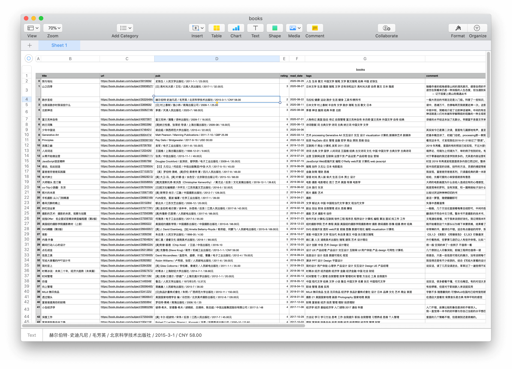

# Douban Read Download

> Download your book reading records from douban to a CSV file.

# Quick Start

## Install Deps

```bash
pip install -r requirements.txt
```

## Usage

#### Step 1:

Copy your cookie from douban *https://book.douban.com/mine?status=collect* page into `.env.example` file, drop the suffix `.example` then.


#### Step 2:

```bash
scrapy runspider start.py
```

Would create a CSV file named `books.csv` with all your reading records



# LICENSE

**douban_read_download** © [geekplux](https://github.com/geekplux), Released under the [MIT](./LICENSE) License.<br>
Authored and maintained by geekplux with help from contributors ([list](https://github.com/geekplux/douban_read_download/contributors)).

> [geekplux.com](http://geekplux.com) · GitHub [@geekplux](https://github.com/geekplux) · Twitter [@geekplux](https://twitter.com/geekplux)
